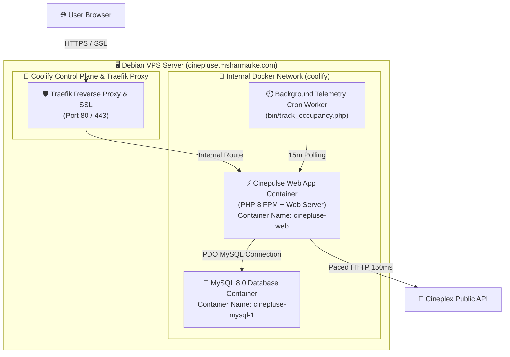
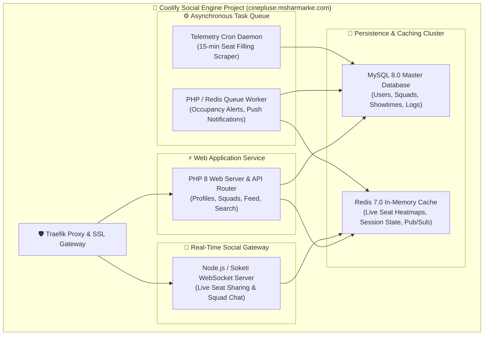

# 🚀 Cinepulse Coolify VPS Infrastructure & Social Network Engine Master Manual

> **Single Source of Truth (SSOT)** for VPS Host Topology, Coolify PaaS Container Orchestration, Docker Compose Service Specifications, Reverse Proxy SSL Gateway, and the Expansion Plan into the **Cinepulse Social Network Engine**.

---

## 1. 🌐 Executive Host Identity & Production Metrics

| Component | Technical Specification |
| :--- | :--- |
| **Production Domain** | `https://cinepluse.msharmarke.com` |
| **PaaS Orchestrator** | **Coolify** (Self-Hosted PaaS on Debian Linux VPS) |
| **Reverse Proxy & SSL** | **Traefik Proxy** (Automatic Let's Encrypt SSL Termination on Port 80/443) |
| **Application Runtime** | **PHP 8.x (FPM & CLI)** in Docker Container (`cinepluse-web`) |
| **Database Container** | **MySQL 8.0** (`cinepluse-mysql-1` on internal Docker network `coolify`) |
| **Caching & Pub/Sub** | **Redis 7.0** (`cinepluse-redis-1` for seat velocity & real-time state) |
| **Admin Passcode** | `ms88` (Configured in `config/config.ini` / Coolify ENV `ADMIN_PASSWORD`) |
| **Primary Repository** | `https://github.com/msharmarke/cinepluse.git` (`main` branch) |
| **Deployment Mechanism** | Automated GitHub Webhook -> Coolify Rolling Container Rebuild |

---

## 2. 🏛️ How the VPS & Container Stack Currently Runs

Cinepulse runs inside a Dockerized container cluster orchestrated by **Coolify** on your Debian VPS.



### Detailed Service Component Breakdown

1. **Traefik Reverse Proxy & SSL Gateway**:
   - Listens on public ports `80` and `443`.
   - Manages Let's Encrypt SSL certificates automatically for `cinepluse.msharmarke.com`.
   - Routes HTTP traffic to the active application container using Docker container labels.

2. **Cinepulse Web App Container (`cinepluse-web`)**:
   - Houses the PHP 8 runtime, PSR-4 autoloader, and web controllers (`index.php`, `movies.php`, `double-feature.php`, `watch-party.php`, `export_pdf.php`, `admin/*`).
   - Serves static JS and CSS assets (`/public/assets/`).
   - Executes API requests to Cineplex endpoints with a built-in 150ms request pacing delay (`usleep(150000)`).

3. **MySQL Database Container (`cinepluse-mysql-1`)**:
   - Runs MySQL 8.0 inside the shared `coolify` Docker network.
   - Stores schedule records (`weekly_showtimes`), active monitor registries (`tracked_showtimes`), snapshot histories (`showtime_snapshots_history`), release rules (`movie_release_trackers`), and execution logs (`scraper_execution_logs`).

4. **Telemetry Daemon Cron Worker (`bin/track_occupancy.php`)**:
   - Runs every 15 minutes to record live seat occupancy snapshots, compute fill velocity, and halt tracking 3 hours post-start time.

---

## 3. 🍿 Transforming the VPS into the "Cinepulse Social Engine"

To power a full-featured social network for Cineplex moviegoers (Cinema Squads, Live Seat Sharing, Occupancy Hypemeter, Movie Buddy Matchmaking), we will expand the Coolify project into a multi-container microservice stack:



### Social Engine Infrastructure Expansion Plan

| Container Service | Service Name | Role & Architecture Impact |
| :--- | :--- | :--- |
| **Core Web App** | `cinepluse-web` | User profiles, authentication, Cinema Squads UI, movie catalog, search, and REST API. |
| **MySQL Database** | `cinepluse-mysql-1` | Relational storage for users, squads, ticket reservations, comments, theater badges, and showtime schedules. |
| **Redis Cache** | `cinepluse-redis-1` | In-memory cache for live seat fill velocity, crowd heatmaps ("Hypemeter"), active sessions, and WebSocket pub/sub. |
| **Real-Time WebSockets** | `cinepluse-ws` | Node.js / Soketi server powering live interactive seatmap sharing for Cinema Squads. |
| **Async Queue Worker** | `cinepluse-worker` | Processes background push notifications, email seat alerts, and squad invite dispatches. |

---

## 4. 🐳 Coolify Production `docker-compose.yml` Blueprint

This production `docker-compose.yml` can be pasted directly into Coolify under **Project -> Services -> Docker Compose** to deploy the complete Cinepulse Social Engine in 1 click:

```yaml
version: '3.8'

services:
  # 1. Cinepulse Core Web Application
  web:
    build:
      context: .
      dockerfile: Dockerfile
    container_name: cinepluse-web
    restart: always
    environment:
      - APP_ENV=production
      - DB_HOST=cinepluse-mysql-1
      - DB_DATABASE=cinepulse_db
      - DB_USERNAME=cinepulse_user
      - DB_PASSWORD=${DB_PASSWORD:-cinepulse_password}
      - REDIS_HOST=cinepluse-redis-1
      - ADMIN_PASSWORD=${ADMIN_PASSWORD:-ms88}
    labels:
      - "traefik.enable=true"
      - "traefik.http.routers.cinepulse.rule=Host(`cinepluse.msharmarke.com`)"
      - "traefik.http.routers.cinepulse.entrypoints=websecure"
      - "traefik.http.routers.cinepulse.tls.certresolver=letsencrypt"
      - "traefik.http.services.cinepulse.loadbalancer.server.port=80"
    networks:
      - coolify

  # 2. Real-Time WebSocket Server (Cinema Squads Live Seat Sharing)
  ws:
    image: quay.io/soketi/soketi:1.6-16-alpine
    container_name: cinepluse-ws
    restart: always
    environment:
      - SOKETI_DEBUG=0
      - SOKETI_DEFAULT_APP_ID=cinepulse
      - SOKETI_DEFAULT_APP_KEY=cinepulse_ws_key_2026
      - SOKETI_DEFAULT_APP_SECRET=cinepulse_ws_secret_2026
      - SOKETI_DB_REDIS_HOST=cinepluse-redis-1
    labels:
      - "traefik.enable=true"
      - "traefik.http.routers.cinepulse-ws.rule=Host(`cinepluse.msharmarke.com`) && PathPrefix(`/app`, `/apps`, `/ws`)"
      - "traefik.http.routers.cinepulse-ws.entrypoints=websecure"
      - "traefik.http.routers.cinepulse-ws.tls.certresolver=letsencrypt"
      - "traefik.http.services.cinepulse-ws.loadbalancer.server.port=6001"
    networks:
      - coolify

  # 3. Redis In-Memory Cache & Pub/Sub
  redis:
    image: redis:7-alpine
    container_name: cinepluse-redis-1
    restart: always
    command: redis-server --appendonly yes
    volumes:
      - redis_data:/data
    networks:
      - coolify

  # 4. MySQL 8.0 Master Database
  mysql:
    image: mysql:8.0
    container_name: cinepluse-mysql-1
    restart: always
    environment:
      - MYSQL_DATABASE=cinepulse_db
      - MYSQL_USER=cinepulse_user
      - MYSQL_PASSWORD=${DB_PASSWORD:-cinepulse_password}
      - MYSQL_ROOT_PASSWORD=${DB_ROOT_PASSWORD:-cinepulse_root_password}
    volumes:
      - mysql_data:/var/lib/mysql
    networks:
      - coolify

networks:
  coolify:
    external: true

volumes:
  mysql_data:
  redis_data:
```

---

## 5. 🛠️ Operational Cheat Sheet for Coolify & VPS Management

### 1. How Deployment Triggers Work
1. You run `git push origin main` on your machine.
2. GitHub sends an automated Webhook to Coolify at `https://coolify.msharmarke.com`.
3. Coolify triggers a container build, runs health checks, and performs a zero-downtime rolling update.

### 2. Manual 1-Click Sync via Web Endpoint
If you need to force an instant git pull and OPcache flush directly from your browser:
👉 **`https://cinepluse.msharmarke.com/sync.php`**

### 3. Managing Environment Variables in Coolify
In the Coolify Dashboard -> **Applications -> cinepulse -> Environment Variables**:
- `ADMIN_PASSWORD`: Secret admin passcode (default: `ms88`).
- `DB_HOST`: Set to `cinepluse-mysql-1`.
- `DB_DATABASE`: Set to `cinepulse_db`.
- `DB_USERNAME`: Set to `cinepulse_user`.
- `DB_PASSWORD`: Database password.
- `REDIS_HOST`: Set to `cinepluse-redis-1`.

### 4. Viewing Real-Time Container Logs in Coolify
- Go to **Coolify UI -> Applications -> cinepulse -> Logs**.
- Select container: `cinepluse-web`, `cinepluse-mysql-1`, or `cinepluse-ws`.
