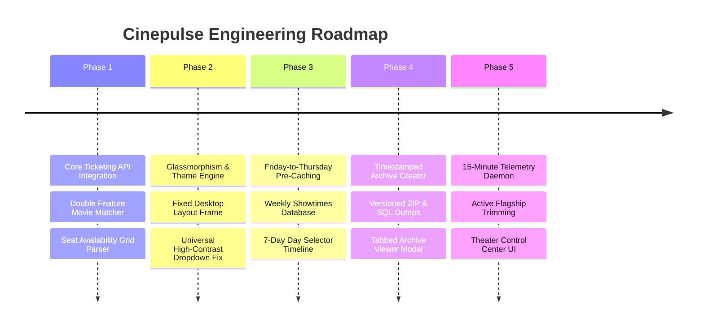

# 🎬 Cinepulse System Evolution & Archive System Journal

## 1. Executive History & Vision

Cinepulse was built to provide real-time seating availability telemetry, box office occupancy analytics, and automated screening analysis for theatrical movies across Canada. 

Over its development journey, Cinepulse evolved from a simple single-theater seat scraper into a production-ready, multi-region theatrical intelligence platform featuring **automated schedule pre-caching**, **15-minute occupancy telemetry**, **portable ZIP archive packaging**, and an **interactive Theater Control Center**.

---

## 2. 🚀 Development Chronology & Architecture Milestones



---

### 🔹 Phase 1: Core Ticketing API Integration & Double Feature Engine
* **Cineplex API Integration** ([`src/CineplexAPI.php`](file:///c:/Users/Moe/Cinepulse/cinepluse-main/src/CineplexAPI.php)): Built robust HTTP client wrappers to communicate directly with Cineplex ticketing endpoints (`/seat-layout`, `/seat-availability`, `/showtimes`).
* **Double Feature Matcher** ([`public/double-feature.php`](file:///c:/Users/Moe/Cinepulse/cinepluse-main/public/double-feature.php)): Created an algorithm that analyzes movie runtimes and buffer windows to generate optimal back-to-back double feature movie pairs for moviegoers.
* **Seating Layout Parser**: Developed JSON layout parsers to convert raw seat grids into visual interactive seat maps.

---

### 🔹 Phase 2: Aesthetic Design System & Desktop Layout Engine
* **Modern Dark Theme & Glassmorphism** ([`public/assets/css/style.css`](file:///c:/Users/Moe/Cinepulse/cinepluse-main/public/assets/css/style.css)): Implemented sleek dark mode palette (`#0b0f19` background, `#171c28` cards), subtle linear gradients, glassmorphism borders, and Google Fonts *Outfit* typography.
* **Fixed Desktop Frame & Window Resizing**: Designed a fixed desktop viewport container to ensure consistent visual hierarchy while gracefully handling browser window resizing.
* **Universal High-Contrast Dropdown Readability Fix**: Solved unreadable browser select dropdown options by enforcing explicit dark background styling across all forms:
  ```css
  select option {
      background-color: #14171d !important;
      color: #ffffff !important;
  }
  ```

---

### 🔹 Phase 3: Theatrical Week Pre-Caching & Schedule Engine
* **Friday-to-Thursday Theatrical Week Model**: Theatrical release schedules operate on a Friday-through-Thursday week cycle. Built [`DashboardService::scrapeFullTheatricalWeek()`](file:///c:/Users/Moe/Cinepulse/cinepluse-main/src/DashboardService.php#L280) to ingest complete 7-day schedule blocks.
* **Database Caching (`weekly_showtimes`)**: Pre-cached thousands of showtime sessions in SQLite, storing screen format, start time, ticket price, and movie metadata.
* **Interactive Day Selector Pills**: Added a 7-day timeline navigator (`Fri Sep 25 TODAY`, `Sat Sep 26`, etc.) on the Admin Dashboard for instant day-by-day schedule exploration.

---

### 🔹 Phase 4: Timestamped Archive Package System & Viewer Modal

To prevent database bloat while maintaining historical records, Cinepulse features a **Timestamped Archive Packaging System** ([`src/ArchiveService.php`](file:///c:/Users/Moe/Cinepulse/cinepluse-main/src/ArchiveService.php)):

#### 📦 Archive Package Structure
Each archive package generated by `createArchivePackage()` creates a standalone ZIP file and directory inside `archives/`:

```
archives/archive_2026-09-25_143000_weekly_snapshot/
├── database_dump.sql     (Full SQLite database schema & records SQL export)
├── movies.csv            (CSV catalogue of all archived movies)
├── showtimes.csv          (CSV export of showtime schedules)
├── manifest.json         (JSON manifest containing archive metadata & counts)
└── README.md             (Human-readable markdown report of archived records)
```

#### 🖥️ Tabbed Archive Viewer Modal
The Admin Dashboard features a modal for inspecting archive packages without extracting them manually:
1. **🎬 Movies Catalog Tab**: Displays all archived movie titles with instant real-time search filtering.
2. **🏛️ Theatres Tracked Tab**: Lists theater locations included in the archive.
3. **📋 Showtimes Sample Tab**: Previews sample showtimes, auditorium screens, and start times.
4. **📂 Files & Manifest Tab**: Inspects exact ZIP file sizes and raw `README.md` metadata.
5. **📥 Database Restore Pipeline**: Admins can click `[📥 Restore Package into Database]` to seamlessly import any historical archive package into the live database.

---

### 🔹 Phase 5: Telemetry Trimming & Active Theater Control Center
* **15-Minute Occupancy Daemon** ([`bin/track_occupancy.php`](file:///c:/Users/Moe/Cinepulse/cinepluse-main/bin/track_occupancy.php)): Automated background daemon that polls active showtimes every 15 minutes and logs seating snapshots to the `snapshots` table.
* **Flagship Location Trimming**: Reduced active background polling scope from 40 locations down to **9 active flagship theaters** (Scotiabank Toronto, Yonge-Dundas, Yorkdale, Mississauga, Scotiabank Montreal, Forum, Scotiabank Vancouver, Chinook Calgary, South Edmonton), trimming API load by **~75%**.
* **Interactive Theater Control Center**: Built a live theater management panel on [`/admin/dashboard`](https://cinepluse.msharmarke.com/admin/dashboard) with province filter buttons (`ON`, `QC`, `BC`, `AB`), search input, and 1-click **`[⏸️ Pause]` / `[▶️ Enable]`** toggle controls.

---

## 3. Summary of Key Milestones & Capabilities

| Feature Capability | Implementation Component | Primary Benefit |
| :--- | :--- | :--- |
| **Schedule Pre-Caching** | `DashboardService::scrapeFullTheatricalWeek()` | Fast instant schedule lookups without waiting for live API calls |
| **Occupancy Telemetry** | `bin/track_occupancy.php` & `TrackerService` | 15-minute seating snapshot logs & sales velocity tracking |
| **Archive Packaging** | `ArchiveService::createArchivePackage()` | Timestamped ZIP packages containing SQL dumps & CSV catalogs |
| **Archive Inspection** | `ArchiveService::getArchiveDetails()` | Tabbed modal viewer with instant movie search & DB restore |
| **Theater Trimming** | `locations.json` & `ShowtimeService` | Reduces API load by 75% while maintaining flagship visibility |
| **Rate Limit Protection** | 150ms `usleep` delay & burst caps | Prevents Cloudflare WAF IP blocks & API rate limit violations |
