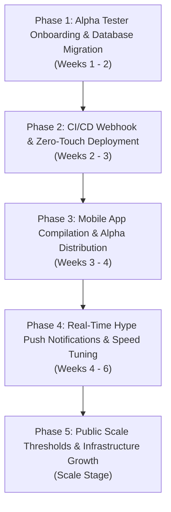

# 🗺️ Cinepulse Master Forward Execution & Product Launch Plan
## Moving from Prototype Repo to Production Alpha Ecosystem

> **Living Master Roadmap** for transitioning Cinepulse from a repository prototype on a shared VPS into a high-scale, zero-cost, multi-platform product used by alpha moviegoers across Canada.

---

## 🏛️ Executive Summary & Core Principles

```
┌───────────────────────────────────────────────────────────────────────────┐
│                       🚀 CINEPULSE LAUNCH PILLARS                         │
├──────────────────┬──────────────────┬──────────────────┬──────────────────┤
│ 1. $0.00 COST    │ 2. SHARED VPS    │ 3. 3 CORE        │ 4. MULTI-PLATFORM│
│ Zero monthly fee │ Max 512MB RAM    │ FEATURES ONLY    │ WEB PWA + NATIVE │
│ Google OAuth & PG│ Shared safely    │ Schedule,        │ CAPACITOR IOS/   │
│ in Docker.       │ with other sites │ Velocity,        │ ANDROID PACKAGE. │
│                  │ (Actra, WP).     │ Passport.        │                  │
└──────────────────┴──────────────────┴──────────────────┴──────────────────┘
```

---

## 📅 Multi-Phase Forward Roadmap



---

## 📌 Phase 1: Alpha Group Onboarding & PostgreSQL Migration
**Timeline**: Weeks 1 – 2 | **Budget**: $0.00

### Objectives:
1. **Provision `cinepluse-pg-1` PostgreSQL Container**:
   - Create isolated `cinepluse-pg-1` container in Coolify.
   - Run [`schema.pg.sql`](file:///c:/Users/Moe/Cinepulse/cinepluse-main/schema.pg.sql) database migration.
2. **Onboard Alpha Group (10–50 Users)**:
   - Invite early cinephile group to log in via Google OAuth 2.0 at `https://cinepluse.msharmarke.com`.
   - Test logging ticket check-in stamps on `/passport`.
3. **Hardware Safety Audit**:
   - Verify RAM stays under **500 MB** and CPU under **15% vCPU** while alpha users log in.

---

## 📌 Phase 2: CI/CD Webhook & Zero-Touch Deployment
**Timeline**: Weeks 2 – 3 | **Budget**: $0.00

### Objectives:
1. **Automate Coolify Deployment Webhook**:
   - Configure GitHub Webhook `https://46.202.93.83:8000/api/v1/deploy/...` in repository settings.
   - Any git push to `origin main` automatically rebuilds and deploys the web container without manual SSH intervention.
2. **Bake Git Client into Dockerfile**:
   - Update `Dockerfile` to include `git` in the PHP-Apache image build step so `opcache_reset()` and git sync operate smoothly inside the container.

---

## 📌 Phase 3: Mobile App Compilation & Alpha Distribution
**Timeline**: Weeks 3 – 4 | **Budget**: $0.00

### Objectives:
1. **Build Capacitor Native Packages**:
   - Compile iOS (`.ipa`) and Android (`.apk`) native app packages using [`capacitor.config.json`](file:///c:/Users/Moe/Cinepulse/cinepluse-main/capacitor.config.json).
2. **Zero-Cost Distribution Channel**:
   - Provide direct `.apk` downloads at `https://cinepluse.msharmarke.com/download-app` for Android alpha testers.
   - Use Apple TestFlight (or PWA "Add to Home Screen" install banner) for iOS alpha testers without paying $99 Developer fees during alpha testing.

---

## 📌 Phase 4: Real-Time Hype Push Notifications & Speed Tuning
**Timeline**: Weeks 4 – 6 | **Budget**: $0.00

### Objectives:
1. **"Selling Fast" Browser/App Push Alerts**:
   - Trigger native web/app push notifications when a showtime velocity crosses 80% occupancy (e.g., *"Interstellar 70mm IMAX at Scotiabank Toronto is nearly full!"*).
2. **OPcache & Redis Latency Audit**:
   - Ensure all REST API calls respond in **< 15 ms** for web and mobile clients.

---

## 📌 Phase 5: Scale Thresholds & VPS Expansion Rules
**Timeline**: Growth Stage | **Budget**: Variable ($0 until 50k+ DAU)

```
┌─────────────────────────────────────────────────────────────────────────────┐
│                       📊 CAPACITY & SCALING THRESHOLDS                      │
├──────────────────┬──────────────────┬──────────────────┬────────────────────┤
│ User Traffic     │ Server Memory    │ Strategy         │ Host Action        │
├──────────────────┼──────────────────┼──────────────────┼────────────────────┤
│ 0 – 10,000 DAU   │ < 500 MB RAM     │ Zero-Cost Shared │ Maintain current   │
│                  │                  │ VPS Stack        │ 8GB VPS setup.     │
├──────────────────┼──────────────────┼──────────────────┼────────────────────┤
│ 10k – 50k DAU    │ 500MB – 1.2GB    │ Enable Redis     │ Add Redis container│
│                  │                  │ Pub/Sub Cache    │ in Coolify ($0).   │
├──────────────────┼──────────────────┼──────────────────┼────────────────────┤
│ 50,000+ DAU      │ > 2.5 GB RAM     │ Separate Engine  │ Move Cinepulse to  │
│                  │                  │ VPS              │ dedicated $10 VPS. │
└──────────────────┴──────────────────┴──────────────────┴────────────────────┘
```

---

## 🎯 Immediate Next Actions (This Week)

1. **PostgreSQL Migration**: Spin up `cinepluse-pg-1` container in Coolify and load `schema.pg.sql`.
2. **Alpha Tester Onboarding**: Share `https://cinepluse.msharmarke.com` with your initial group of 10–20 moviegoers.
3. **Capacitor Android Build**: Run `npx cap sync` to generate the first test `.apk`.
