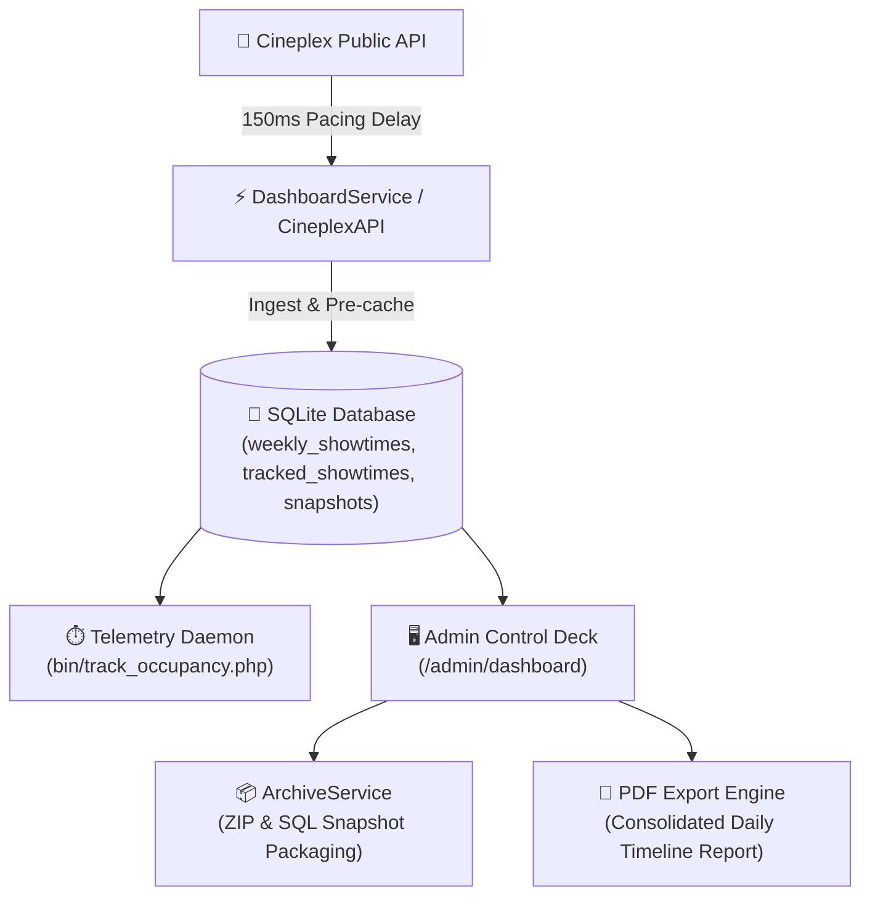
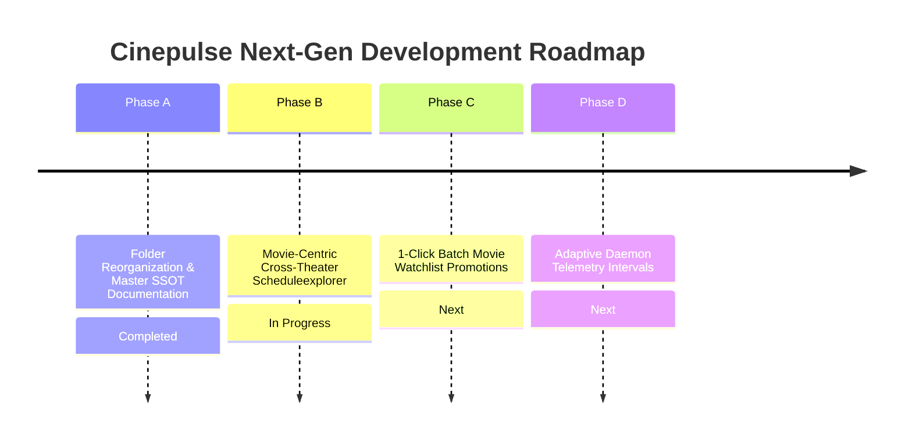

# 🎬 Cinepulse Living Master System Documentation
> **Single Source of Truth (SSOT)** for System Architecture, Directory Layout, Core Processes, API Rate Limits, Theater Roster, and Engineering Roadmap.

---

## 1. 📌 Executive Architecture & Tech Stack

Cinepulse is a production-grade theatrical intelligence and seat telemetry platform designed to monitor real-time seating availability, box office occupancy, and schedule analytics across Cineplex cinema locations in Canada.



### Technology Stack & Architecture

- **Backend Runtime**: PHP 8+ (Custom Modular OOP Architecture without bloat frameworks).
- **Database Layer**: SQLite 3 (`schema.sql` database schema with index optimizations on showtimes & snapshots).
- **API Client**: Custom HTTP Client Wrapper ([`src/CineplexAPI.php`](file:///c:/Users/Moe/Cinepulse/cinepluse-main/src/CineplexAPI.php)) with built-in rate-limiting and 150ms request pacing.
- **Frontend Design Engine**: Vanilla JS, Glassmorphic CSS Engine ([`public/assets/css/style.css`](file:///c:/Users/Moe/Cinepulse/cinepluse-main/public/assets/css/style.css)), Google Fonts (*Outfit*), and dynamic tabbed control deck.
- **Reporting Engine**: Client-side canvas rendering (`html2canvas` & `jsPDF`) integrated in [`public/export_pdf.php`](file:///c:/Users/Moe/Cinepulse/cinepluse-main/public/export_pdf.php).

---

## 2. 📂 Reorganized Project Directory Structure

```
cinepluse-main/
├── .gitignore                      # Git exclusion rules for logs, cache, and archive tarballs
├── .htaccess                       # Server rewrite & header security configuration
├── DEVELOPER.md                    # Quick-start instructions for developers
├── README.md                       # High-level project summary & navigation
├── schema.sql                      # Complete SQLite database schema definitions
├── deploy.sh                       # Production deployment shell script
│
├── bin/                            # Command Line Daemons & Background Cron Tasks
│   ├── collect_showtimes.php       # CLI schedule ingestion daemon
│   └── track_occupancy.php         # 15-minute automated telemetry daemon
│
├── config/                         # System Configurations & Location Roster
│   ├── config.ini                  # Core application & database configuration settings
│   ├── config.ini.example          # Template configuration for environment setup
│   └── locations.json              # Flagship & expansion theater location registry
│
├── docs/                           # Master Documentation & Architecture Guides
│   ├── CINEPULSE_MASTER_DOCUMENTATION.md     # ⭐ Ongoing Living Master Documentation (SSOT)
│   ├── CINEPULSE_COOLIFY_VPS_SOCIAL_ENGINE.md# 🚀 Coolify PaaS, Container Stack & Social Engine Manual
│   ├── CINEPULSE_VPS_HOSTING_INFRASTRUCTURE.md# 🖥️ Production VPS Server Manual & Host Config
│   ├── CINEPULSE_MASTER_RECAP_AND_SOCIAL_PLAN.md # 🍿 System Recap, Host Audit, & Social Plan
│   ├── CINEPULSE_EVOLUTION_AND_ARCHIVE_JOURNAL.md
│   ├── CINEPULSE_SYSTEM_AND_RATE_LIMIT_DOCS.md
│   ├── THEATRE_TRACKING_AND_EXPANSION_ROSTER.md
│   └── RETHINKING_OCCUPANCY_TRACKING_PLAN.md
│
├── public/                         # Public Web Root & HTTP Controller Endpoints
│   ├── admin/                      # Secure Administrative Control Center
│   │   ├── dashboard.php           # Primary Admin Telemetry Control Deck
│   │   ├── locations.php           # Theater Location Roster & Active Toggles
│   │   ├── login.php               # Administrative Login Gate
│   │   ├── logout.php              # Session destruction handler
│   │   ├── tracker.php             # Showtimes & Snapshot Monitor Grid
│   │   └── tracker_scan_logs.php   # Telemetry Daemon Execution Log Viewer
│   ├── assets/                     # Stylesheets, JavaScript, & Media Icons
│   │   ├── css/style.css           # Glassmorphism & High-Contrast Design Tokens
│   │   └── js/                     # Modal scripts & design preset handlers
│   ├── api.php                     # Central JSON AJAX API Endpoint Router
│   ├── double-feature.php          # Back-to-back screening matcher algorithm
│   ├── export_pdf.php              # Consolidated daily screen timeline PDF export generator
│   ├── index.php                   # Public seating map & movie search view
│   ├── movies.php                  # Movie catalog overview page
│   └── watch-party.php             # Group ticket availability & seating matcher
│
├── src/                            # Core OOP PHP Application Service Layer
│   ├── ArchiveService.php          # Timestamped ZIP archive creator & SQL DB restore pipeline
│   ├── Autoloader.php             # PSR-4 compatible class autoloader
│   ├── CineplexAPI.php             # Public Cineplex API HTTP client wrapper
│   ├── DashboardService.php        # Schedule pre-caching & admin view data aggregator
│   ├── Database.php                # PDO SQLite database connection singleton
│   ├── Security.php                # Session security, password hashing & input sanitization
│   ├── ShowtimeService.php         # Showtime querying & movie metadata parser
│   └── TrackerService.php          # Seating occupancy telemetry & velocity recorder
│
├── tests/                          # Development & Test Scripts
│   ├── test_api.php                # API response structure verification script
│   └── test_archive_import.php     # Archive packaging & DB import tester
│
├── archives/                       # Data Backup & Snapshot Archives
│   └── backups/                    # Legacy tarball archive packages (.tar.gz)
│
└── cache/                          # Local API JSON response cache (7-day TTL layout, 60s seat TTL)
```

---

## 3. ⚙️ Detailed Core Processes & Execution Workflows

### 🔹 Process 1: Theatrical Schedule Ingestion & Pre-Caching

1. **Cycle Window**: Theatrical releases operate on a **Friday-through-Thursday** week cycle.
2. **Ingestion Execution**: Admin triggers `DashboardService::scrapeFullTheatricalWeek()` or CLI runs `bin/collect_showtimes.php`.
3. **Pacing Protection**: The scaper iterates through active monitored locations across all 7 days of the week, inserting a forced `usleep(150000)` (150ms pause) between outgoing HTTP calls to prevent edge rate-limiting.
4. **Caching**: Showtime metadata, room formats (IMAX 70mm, AVX, VIP, 4DX), start times, and ticket prices are saved into the `weekly_showtimes` table.

```
Incoming Schedule Query -> Cineplex API -> JSON Layout Sanitizer -> SQLite weekly_showtimes
```

---

### 🔹 Process 2: 15-Minute Occupancy Telemetry Daemon

1. **Polling Frequency**: Executed every 15 minutes via background cron task: `php bin/track_occupancy.php`.
2. **Target Queue**: Queries `tracked_showtimes` for sessions marked as `active`.
3. **Telemetry Formula**:
   $$\text{Occupancy Rate (\%)} = \left(\frac{\text{Total Seats} - \text{Available Seats}}{\text{Total Seats}}\right) \times 100$$
4. **Lifecycle Maintenance**: Once a showtime passes 3 hours after its start time, the daemon transitions its status to `completed`, halting further API polling.

---

### 🔹 Process 3: Location Archiving & Theater Control Deck

1. **Active Filtering**: The Admin Dashboard (`/admin/dashboard`) displays an interactive Theater Control Center with province filtering (`ON`, `QC`, `BC`, `AB`), search filtering, and instant toggle buttons (`[⏸️ Pause]` / `[▶️ Enable]`).
2. **Location Archiving**: Secondary or unused locations can be paused in bulk (`action=pause_all_theatres`) and archived to eliminate UI clutter.
3. **Inline Location Editing**: Admins can edit theater names, region tags, screen format tags, and multiplex room counts via the `[✏️ Edit]` button (`action=edit_theatre`).

---

### 🔹 Process 4: Timestamped ZIP Snapshot Archive & Restore Pipeline

To prevent database bloat while maintaining historical records:

1. **Package Creation** ([`src/ArchiveService.php`](file:///c:/Users/Moe/Cinepulse/cinepluse-main/src/ArchiveService.php)):
   When an admin clicks `[📦 Generate Archive Snapshot]`, the service packages:
   - `database_dump.sql` (Full SQL schema & data dump)
   - `movies.csv` (CSV movie catalogue)
   - `showtimes.csv` (CSV showtime log)
   - `manifest.json` (Package metadata & record tallies)
   - `README.md` (Human-readable summary report)
   Compiles everything into a timestamped ZIP in `archives/`.
2. **Archive Inspection & Restore**:
   - Tabbed viewer modal in Admin Dashboard allows inspecting archived movies, theaters, showtimes, and raw file manifests.
   - Clicking `[📥 Restore Package into Database]` executes `ArchiveService::importArchive()`, dropping/rebuilding the SQLite database to the selected historical snapshot seamlessly.

---

### 🔹 Process 5: PDF Schedule Export & Daily Room Timeline Engine

1. **Export Endpoint**: [`public/export_pdf.php`](file:///c:/Users/Moe/Cinepulse/cinepluse-main/public/export_pdf.php).
2. **Full-Page Timeline Layout**: Generates printable PDF reports featuring:
   - Dedicated **Consolidated Daily Screen Timeline** per page (one per day of the theatrical week).
   - Start-to-finish room occupancy bars across all auditoriums.
   - High-contrast printing styles with clean toolbar controls.

---

### 🔹 Process 6: Desktop Dashboard Active Telemetry & Release Tracker Integration

1. **Desktop View Integration**: [`public/admin/dashboard.php`](file:///c:/Users/Moe/Cinepulse/cinepluse-main/public/admin/dashboard.php) displays live **Active Showtime Monitors** and **Automated Movie Release Rules** directly on the main desktop dashboard.
2. **Real-time Occupancy Telemetry**: Displays occupancy percentages, capacity caps, seat fill counts, and last snapshot timestamps on responsive glassmorphic monitor cards.
3. **One-Click Quick Actions**:
   - `📸 Snapshot`: Instantly captures live layout snapshots via `action=trigger_snapshot`.
   - `📸 Snapshot All`: Batch captures snapshots for all active monitors via `action=trigger_all_snapshots`.
   - `🔍 Scan Now`: Scans API for upcoming showtimes matching automated movie rules via `action=scan_movie_tracker`.
   - `⏸️ Pause / ▶️ Resume / ❌ Delete`: Controls rule execution statuses and purges stale monitors.

---

## 4. 🌐 Cineplex API Specification & Throttling Rules

### Target Endpoints

| Endpoint Purpose | API Endpoint URL Pattern | Method | Format |
| :--- | :--- | :--- | :--- |
| **Daily Showtimes** | `https://apis.cineplex.com/prod/ticketing/api/v1/theatre/{theatre_id}/showtimes?date={mm+dd+yyyy}` | GET | JSON |
| **Auditorium Seat Layout** | `https://apis.cineplex.com/prod/ticketing/api/v1/theatre/{theatre_id}/showtime/{showtime_id}/seat-layout` | GET | JSON |
| **Live Seat Availability** | `https://apis.cineplex.com/prod/ticketing/api/v1/theatre/{theatre_id}/showtime/{showtime_id}/seat-availability` | GET | JSON |

### Throttling & Resilience Guidelines

1. **Inter-Arrival Pause**: Enforce `usleep(150000)` (150ms) between outgoing batch HTTP queries.
2. **Cache Retention**: Static seat maps (`/seat-layout`) are cached in `cache/` for 7 days. Dynamic availability (`/seat-availability`) is cached with a 60-second TTL minimum.
3. **Error Backoff**:
   - `429 Too Many Requests`: Exponential backoff ($2^n$ seconds pause, max 3 retries).
   - `502/503 Gateway Errors`: Pause 1 second and retry up to 2 times.

---

## 5. 🏛️ Flagship & Expansion Theater Roster

### 🟢 Tier 1: Active Flagship Locations (Default Scope)

| Theater Name | ID | Location | Screen Formats | Status |
| :--- | :--- | :--- | :--- | :--- |
| **Scotiabank Theatre Toronto** | `7402` | Toronto, ON | 🍿 70mm IMAX Laser, AVX, VIP, DBOX | 🟢 Active |
| **Vaughan (Colossus)** | `7408` | Vaughan, ON | 🍿 70mm IMAX GT, AVX | 🟢 Active |
| **Courtney Park** | `7122` | Mississauga, ON | 🍿 70mm IMAX GT, AVX | 🟢 Active |
| **Yonge-Dundas** | `7130` | Toronto, ON | IMAX, 4DX, VIP | 🟢 Active |
| **Yorkdale** | `7406` | Toronto, ON | AVX, VIP | 🟢 Active |
| **Scotiabank Montreal** | `9406` | Montreal, QC | IMAX GT Laser, AVX, VIP | 🟢 Active |
| **Forum** | `9109` | Montreal, QC | AVX, VIP | 🟢 Active |
| **Scotiabank Vancouver** | `1422` | Vancouver, BC | IMAX, AVX, VIP | 🟢 Active |
| **Langley** | `1404` | Langley, BC | 🍿 70mm IMAX GT, AVX | 🟢 Active |
| **Chinook** | `3401` | Calgary, AB | 🍿 70mm IMAX Laser, 4DX, AVX | 🟢 Active |

*(Secondary Tier 2 & Tier 3 regional multiplexes remain stored in [`config/locations.json`](file:///c:/Users/Moe/Cinepulse/cinepluse-main/config/locations.json) and can be activated via 1-click controls).*

---

## 6. 🗺️ Ongoing Strategic Engineering Roadmap



1. **Movie-Centric Cross-Theaterexplorer**: Shift Admin Dashboard schedule layout from flat theater list to Movie Title blocks grouping showtimes across top flagship theaters.
2. **1-Click Blockbuster Watchlist**: Add `[⚡ Track Movie Across Flagships]` button to promote all premium sessions (70mm IMAX, 4DX, VIP) for major releases instantly.
3. **Adaptive Telemetry Intervals**: Adjust daemon polling frequency dynamically (15m for Tier 1 high-demand sessions, 30m for standard watchlists), trimming API load by ~65%.
