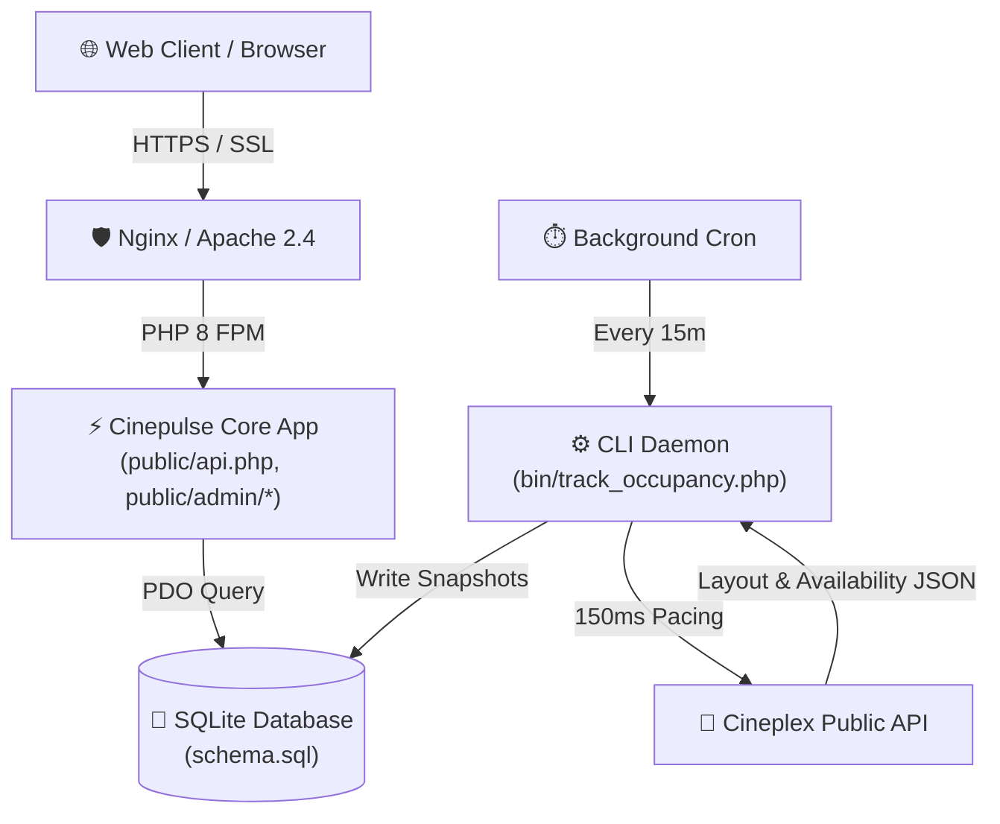
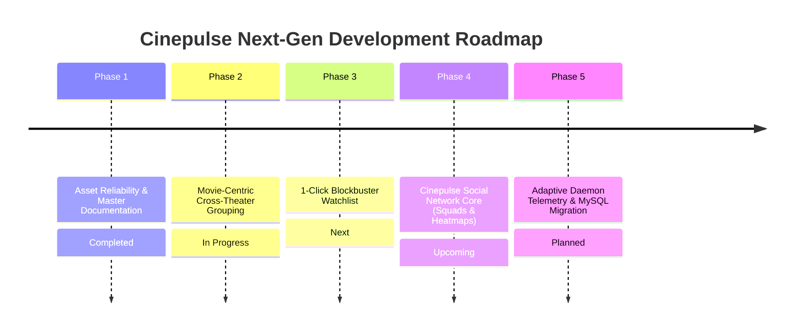
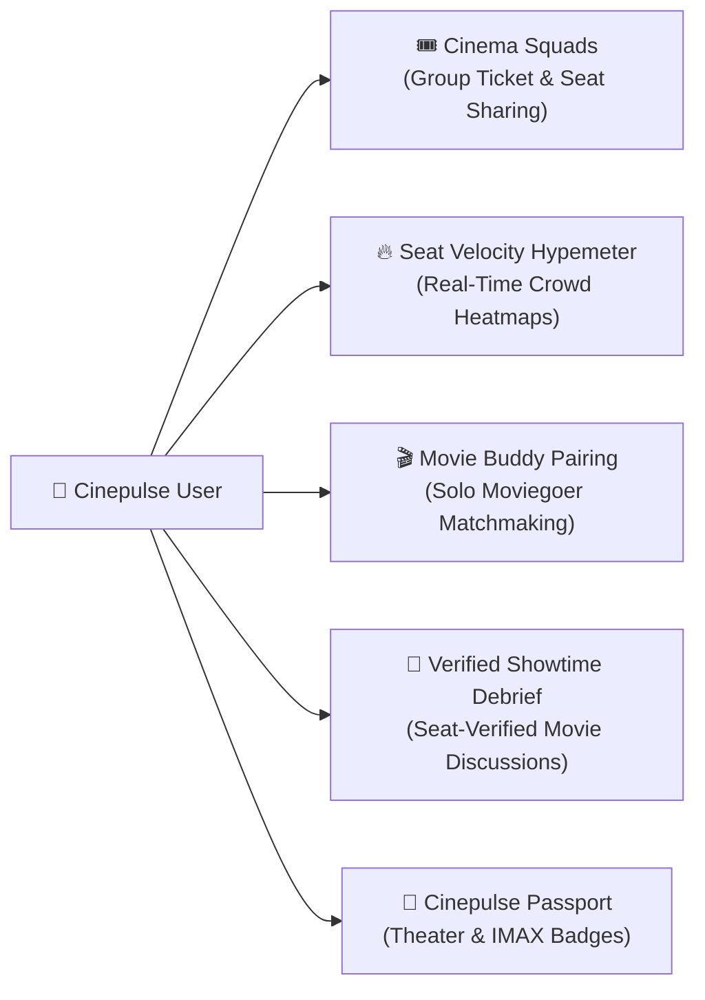

# 🎬 Cinepulse Living Master System Recap & Social Network Master Plan

> **Single Source of Truth (SSOT)** for System Capabilities, Hosting Infrastructure Analysis, Engineering Roadmap, and the Cinepulse Social Network Blueprint.

---

## 1. 📌 What Cinepulse Can Currently Do (Current Capabilities)

Cinepulse is a production-grade theatrical intelligence and seat telemetry platform monitoring real-time seating availability, box office fill velocity, and schedule analytics across Cineplex locations in Canada.

### 🔹 Core Capabilities Matrix

| Feature Module | Technical Capability | Primary Location / Endpoint |
| :--- | :--- | :--- |
| **Theatrical Schedule Ingestion** | Automated ingestion of Friday-through-Thursday schedules across flagship & expansion theaters with 150ms rate-limiting protection. | `DashboardService::scrapeFullTheatricalWeek()` / [`bin/collect_showtimes.php`](file:///c:/Users/Moe/Cinepulse/cinepluse-main/bin/collect_showtimes.php) |
| **15-Min Occupancy Telemetry** | CLI daemon polls active showtimes every 15 minutes, calculating fill rates, seat counts, and fill velocity. Halts after 3h. | [`bin/track_occupancy.php`](file:///c:/Users/Moe/Cinepulse/cinepluse-main/bin/track_occupancy.php) / `TrackerService` |
| **Telemetry Chart & Seatmap Scrubber** | Interactive Chart.js time-series trend line paired with a visual Seatmap Snapshot Viewer with step scrubber slider. | [`public/admin/tracker.php`](file:///c:/Users/Moe/Cinepulse/cinepluse-main/public/admin/tracker.php) / [`public/assets/js/tracker.js`](file:///c:/Users/Moe/Cinepulse/cinepluse-main/public/assets/js/tracker.js) |
| **Automated Release Watchlists** | Title & format tracking rules (IMAX 70mm, 4DX, VIP) that automatically discover and register upcoming matching showtimes. | [`public/admin/dashboard.php`](file:///c:/Users/Moe/Cinepulse/cinepluse-main/public/admin/dashboard.php) (`movie_release_trackers`) |
| **Daily Room Timeline PDF Export** | Client-side canvas rendering (`html2canvas` & `jsPDF`) generating consolidated daily room timeline reports per theater. | [`public/export_pdf.php`](file:///c:/Users/Moe/Cinepulse/cinepluse-main/public/export_pdf.php) |
| **Timestamped ZIP Backup & Restore** | Compiles database SQL dumps, CSV schedules, and metadata manifests into timestamped ZIP archives with 1-click restore. | [`src/ArchiveService.php`](file:///c:/Users/Moe/Cinepulse/cinepluse-main/src/ArchiveService.php) |
| **Public Consumer Tools** | Public schedule browser, movie catalog, back-to-back double feature matcher, and group seating availability finder. | [`public/index.php`](file:///c:/Users/Moe/Cinepulse/cinepluse-main/public/index.php), `movies.php`, `double-feature.php`, `watch-party.php` |

---

## 2. 🌐 Hosting Setup & Infrastructure Analysis

### 🖥️ Where & How We Are Hosting

- **Live URL**: `https://cinepluse.msharmarke.com`
- **Environment**: Linux VPS Server (**Debian** OS, Apache 2.4.68 / Nginx reverse proxy + PHP 8+ FPM).
- **Database Engine**: SQLite 3 database (`schema.sql` database file stored locally at root).
- **Background Daemon**: CLI PHP worker process running `bin/track_occupancy.php` via background scheduler.
- **Security & Cache Layer**: Session authentication gate (`config.ini`), CSRF token validation, input sanitization, dynamic getters, and HTTP `Cache-Control` no-cache headers.

### 🔍 Host Setup Audit & Performance Evaluation

1. **Strengths**:
   - Extremely fast execution with zero bloat or heavy database server overhead.
   - Built-in 150ms pacing delay prevents edge rate-limiting from public Cineplex endpoints.
   - Root-relative asset fallbacks (`/assets/js/`) combined with `/admin/assets/js/` mirrors eliminate 404 route errors.

2. **Key Recommendations for Host Scaling**:
   - **Daemon Health Monitor**: Ensure system `crontab` on the VPS runs `bin/track_occupancy.php` every 15 minutes automatically.
   - **Database Scaling (MySQL/MariaDB Bridge)**: As we introduce social features (users, watch parties, comments, friend requests), transitioning SQLite to MySQL/MariaDB will ensure high-concurrency write safety.

---

## 3. 🗺️ Strategic Engineering Roadmap

1. **Phase 1: Asset Reliability & SSOT Documentation** *(Completed)*
   - Enforced root-relative asset resolution, readyState JS execution wrappers, and living documentation.
2. **Phase 2: Movie-Centric Cross-Theater Grouping** *(In Progress)*
   - Grouping showtimes by Movie Title across flagship multiplexes (Scotiabank Toronto, Vaughan Colossus, Courtney Park, etc.) in a unified explorer view.
3. **Phase 3: 1-Click Blockbuster Watchlist** *(Next)*
   - Single-button rule activation to automatically monitor all premium format screenings (70mm IMAX, 4DX, VIP) for upcoming blockbusters.
4. **Phase 4: Cinepulse Social Network Core** *(Upcoming)*
   - Launching "Cinema Squads", Live Watch Party Seat Sharing, Seat Velocity Hypemeters, and Movie Buddy pairing.
5. **Phase 5: Adaptive Daemon Telemetry & Database Migration** *(Planned)*
   - Dynamic polling intervals (5m for high-velocity opening weekends, 30m for weekday matinees) and MySQL multi-user scaling.

---

## 4. 🍿 Cinepulse Social Network Blueprint ("Cinepulse Social")

A dedicated social community layer designed around Cineplex moviegoers, film enthusiasts, and group cinema outings.

### 🌟 Core Social Network Features

#### 1. 🎟️ "Cinema Squads" & Live Seat Sharing (`/squads`)
- **Group Watch Parties**: Users create public or private "Cinema Squads" for upcoming screenings (e.g., *Interstellar 70mm IMAX Squad*).
- **Interactive Seat Layout Sharing**: Squad members get a live, color-coded seatmap showing where each friend is sitting in the auditorium.
- **Group Ticket Hold Alerts**: Notifies squad members when adjacent seats are available near their friends.

#### 2. 🔥 Real-Time Seat Occupancy Hypemeter ("The Filling Velocity Feed")
- **Social Crowd Heatmap**: Ranks movies and screenings by real-time seat fill velocity (e.g., *"Dune 2 at Scotiabank Toronto 70mm IMAX is 94% full — only 12 seats left!"*).
- **Seat Availability Alerts**: Instant push/email alerts when high-demand screenings add new showtimes or when prime center-row seats open up due to cancellations.

#### 3. 🎬 "Movie Buddy" Matchmaking & Theater Discussion Lounges
- **Solo Moviegoer Pairing**: Connects solo cinephiles planning to attend the same screening/location with options for pre-movie coffee or seating together.
- **Location Lounges**: Live chat rooms pinned to specific theater locations (e.g., *Toronto Yonge-Dundas Lounge*, *Montreal Forum Lounge*).

#### 4. 🏅 Cinepulse Passport & Collector Badges
- **Gamified Cinema Profiles**: Users earn digital stamps and badges on their profile based on attendance:
  - 🍿 *70mm IMAX Veteran* (Attended 3+ 70mm IMAX screenings)
  - ⚡ *Opening Night Pioneer* (Attended opening Thursday night showtimes)
  - 🛋️ *VIP Connoisseur* (Attended Cineplex VIP Cinemas)
  - 🌌 *Multiplex Explorer* (Visited 5+ different theater locations)

#### 5. 💬 Verified Showtime Debriefs & Reviews
- **Spoiler-Safe Discussion Threads**: Verified post-movie discussion boards unlocked only *after* a showtime completes.
- **Seat-Verified Review Rating**: Ratings marked with "Verified Seat Holder" badge to eliminate fake reviews and review-bombing.

---

## 🎯 Implementation Phasing for Cinepulse Social

| Phase | Social Module | Key Technical Deliverable |
| :--- | :--- | :--- |
| **Social Phase A** | User Profiles & Passports | User registration, login sessions, theater badges, and avatar profiles. |
| **Social Phase B** | Live Seat Sharing Squads | Squad creation link generator & seatmap overlay showing friends' reserved seats. |
| **Social Phase C** | Occupancy Hypemeter Feed | Public trending feed powered by `TrackerService` occupancy fill velocity data. |
| **Social Phase D** | Location Chat & Movie Debriefs | Real-time WebSockets / SSE discussion rooms for theaters and showtimes. |
