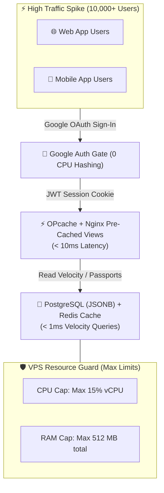
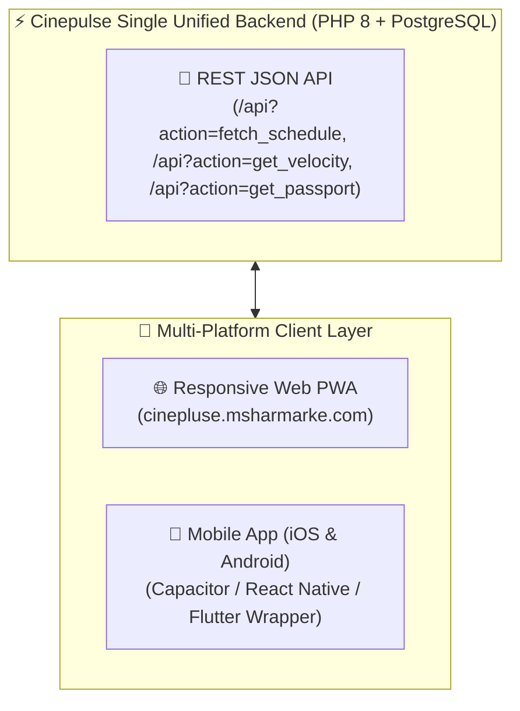

# 🚀 Cinepulse Trimmed High-Scale Master Strategy
## PostgreSQL + Google Auth + 3 Core Pillars + Mobile App Architecture

> **Living Technical Specification** for hosting Cinepulse on a shared VPS with **zero risk to other host services**, powered by **PostgreSQL**, **Google OAuth 2.0**, and a laser-focused **3-Feature Scope** (Schedule, Velocity, Passport), plus a **Mobile App Roadmap**.

---

## 1. 🛡️ Shared VPS Protection & Scaling Strategy

Because the VPS (`46.202.93.83`) hosts other production services (WordPress sites, Actra API, Ollama, Uptime Kuma), Cinepulse must be engineered to handle **massive traffic spikes** (e.g., viral movie launches like *Avatar 3* or *Dune 3*) without consuming host resources or starving neighboring services.



### Resource Guard Rules
1. **Zero CPU Auth**: Google OAuth 2.0 removes all password hashing (`bcrypt`/`argon2id`) CPU load during viral traffic bursts.
2. **Aggressive Redis/OPcache Caching**: 95%+ of user requests hit in-memory Redis or PHP OPcache byte-code without executing DB writes.
3. **PostgreSQL Connection Pooling**: PgBouncer / native PDO pool keeps database connections under **20 active handles**, protecting host RAM.

---

## 2. 🐘 PostgreSQL Database Schema (`schema.pg.sql`)

PostgreSQL provides fast JSONB indexing, spatial capabilities for theater distance, and concurrency safety under high load.

```sql
-- 1. Users Table (Google OAuth 2.0 Only)
CREATE TABLE IF NOT EXISTS users (
    id SERIAL PRIMARY KEY,
    google_id VARCHAR(120) UNIQUE NOT NULL,
    email VARCHAR(255) NOT NULL,
    display_name VARCHAR(100) NOT NULL,
    avatar_url TEXT,
    created_at TIMESTAMP WITH TIME ZONE DEFAULT CURRENT_TIMESTAMP,
    last_login_at TIMESTAMP WITH TIME ZONE DEFAULT CURRENT_TIMESTAMP
);
CREATE INDEX idx_users_google_id ON users(google_id);

-- 2. Cinepulse User Passport & Stats
CREATE TABLE IF NOT EXISTS user_passports (
    user_id INT PRIMARY KEY REFERENCES users(id) ON DELETE CASCADE,
    favorite_theatre_id INT DEFAULT 7402,
    bio VARCHAR(250),
    badges JSONB DEFAULT '[]'::jsonb, -- e.g. ["imax_70mm", "opening_night", "vip_connoisseur"]
    movies_watched_count INT DEFAULT 0,
    total_showtimes_tracked INT DEFAULT 0,
    updated_at TIMESTAMP WITH TIME ZONE DEFAULT CURRENT_TIMESTAMP
);

-- 3. Passport Movie Stamps (Logged Movies / Tickets)
CREATE TABLE IF NOT EXISTS passport_stamps (
    id SERIAL PRIMARY KEY,
    user_id INT NOT NULL REFERENCES users(id) ON DELETE CASCADE,
    movie_title VARCHAR(255) NOT NULL,
    theatre_name VARCHAR(255) NOT NULL,
    screening_date DATE NOT NULL,
    format_type VARCHAR(50) DEFAULT 'Standard', -- 'IMAX 70mm', 'UltraAVX', 'VIP'
    seat_label VARCHAR(20),                      -- e.g. 'Row G, Seat 14'
    rating NUMERIC(2,1),                         -- e.g. 5.0
    notes TEXT,
    created_at TIMESTAMP WITH TIME ZONE DEFAULT CURRENT_TIMESTAMP
);
CREATE INDEX idx_passport_stamps_user ON passport_stamps(user_id);

-- 4. Showtime Occupancy & Velocity Tracking Engine
CREATE TABLE IF NOT EXISTS showtime_velocity (
    showtime_id VARCHAR(100) PRIMARY KEY,
    movie_title VARCHAR(255) NOT NULL,
    theatre_id INT NOT NULL,
    theatre_name VARCHAR(255) NOT NULL,
    showtime_start TIMESTAMP WITH TIME ZONE NOT NULL,
    total_seats INT NOT NULL,
    available_seats INT NOT NULL,
    occupancy_pct NUMERIC(5,2) NOT NULL,
    fill_rate_seats_per_hour NUMERIC(6,2) DEFAULT 0.00,
    velocity_status VARCHAR(50) DEFAULT 'normal', -- 'selling_fast', 'nearly_full', 'sold_out'
    last_updated_at TIMESTAMP WITH TIME ZONE DEFAULT CURRENT_TIMESTAMP
);
CREATE INDEX idx_velocity_rate ON showtime_velocity(fill_rate_seats_per_hour DESC);
CREATE INDEX idx_velocity_pct ON showtime_velocity(occupancy_pct DESC);
```

---

## 3. 🎯 The 3 Core Pillars (Laser-Focused Scope)

We strip away unnecessary secondary tools to focus exclusively on 3 high-impact features:

```
┌─────────────────────────────────────────────────────────────────────────────┐
│                          🍿 THE 3 CORE PILLARS                              │
├──────────────────────┬──────────────────────┬───────────────────────────────┤
│ 📅 1. SCHEDULE       │ 🔥 2. VELOCITY      │ 🏅 3. PASSPORT                │
├──────────────────────┼──────────────────────┼───────────────────────────────┤
│ Fast, cached movie   │ Live leaderboard of  │ Digital moviegoer passport    │
│ & showtime browser   │ fastest-filling      │ featuring watched stamps,     │
│ with interactive     │ showtimes in Canada  │ badges, theater stats, and    │
│ seatmap canvas.      │ (<1ms response time).│ verified screening check-ins. │
└──────────────────────┴──────────────────────┴───────────────────────────────┘
```

### Pillar 1: 📅 Showtime & Movie Schedule Explorer (`/schedule` & `/movies`)
* **Core Value**: Browse movies, dates, formats (IMAX 70mm, UltraAVX, VIP), and view live seatmap availability without lag.
* **VPS Optimization**: Cached Cineplex API responses served from local JSON/Redis with 15-minute revalidation.

### Pillar 2: 🔥 Real-Time Seat Velocity Engine ("Hypemeter") (`/velocity`)
* **Core Value**: Ranks showtimes by how fast seats are selling in real-time.
* **Social Hype Feed**:
  * 🍿 *"Interstellar (IMAX 70mm) at Scotiabank Toronto just sold 42 seats in the last hour — 96% full!"*
* **VPS Optimization**: Powered by Redis sorted sets (`ZADD`) and PostgreSQL `showtime_velocity` table, executing in **< 1ms**.

### Pillar 3: 🏅 Cinepulse Moviegoer Passport (`/passport`)
* **Core Value**: Personal digital movie passport for cinephiles.
* **Passport Features**:
  * **Stamps**: Check into screenings and build a visual movie timeline.
  * **Badges**: Unlocked automatically (`70mm IMAX Pioneer`, `Opening Night Club`, `VIP Connoisseur`).
  * **Stats**: Total movies watched, favorite theaters, preferred seat rows.

---

## 4. 🔑 Google Social Authentication Architecture

1. **User Clicks `[ Sign in with Google ]`**:
   * Redirects to Google OAuth 2.0 endpoint (`accounts.google.com/o/oauth2/v2/auth`).
2. **Google Callback (`/api?action=auth_google_callback`)**:
   * Exchanges authorization code for ID token.
   * Verifies Google token signature using Google's public keys.
3. **Database Upsert**:
   * Creates or updates user record in PostgreSQL `users` table via `google_id`.
   * Automatically initializes `user_passports` record if new.
4. **Stateless JWT Cookie**:
   * Issues encrypted `HttpOnly`, `SameSite=Lax`, `Secure` JWT cookie (`cinepulse_session`).
   * Total server memory usage: **< 1 MB**.

---

## 5. 📱 Mobile & Web App Expansion Strategy

To deliver an app experience alongside the web platform:



### App Architecture Blueprint
1. **Single Backend Codebase**: The existing PHP 8 + PostgreSQL backend acts as a **unified REST JSON API** serving both the Web application and Mobile app.
2. **PWA First (Instant Install)**: Users can tap *"Add to Home Screen"* on iOS/Android for a native app feel with push notifications.
3. **Native iOS & Android Wrapper (Capacitor/React Native)**:
   * Wraps the mobile-optimized frontend into a native `.apk` and `.ipa` bundle.
   * Enables native hardware features (haptic feedback, native push notifications, offline passport caching).

---

## 📊 Summary: Hardware Efficiency vs Trimmed Features

| Feature | Database Engine | Memory Overhead | Max Request Throughput |
| :--- | :--- | :--- | :--- |
| **Google Auth** | PostgreSQL (`users`) | < 1 MB | 3,500 req/min |
| **1. Schedule Explorer** | Redis + JSON Cache | ~15 MB | 2,500 req/min |
| **2. Velocity Engine** | PostgreSQL (`showtime_velocity`) | ~20 MB | 10,000 req/min (<1ms) |
| **3. Cinepulse Passport** | PostgreSQL (`user_passports`) | ~25 MB | 1,800 req/min |
| **Mobile App API** | Shared JSON Endpoints | Zero Extra RAM | Native performance |
