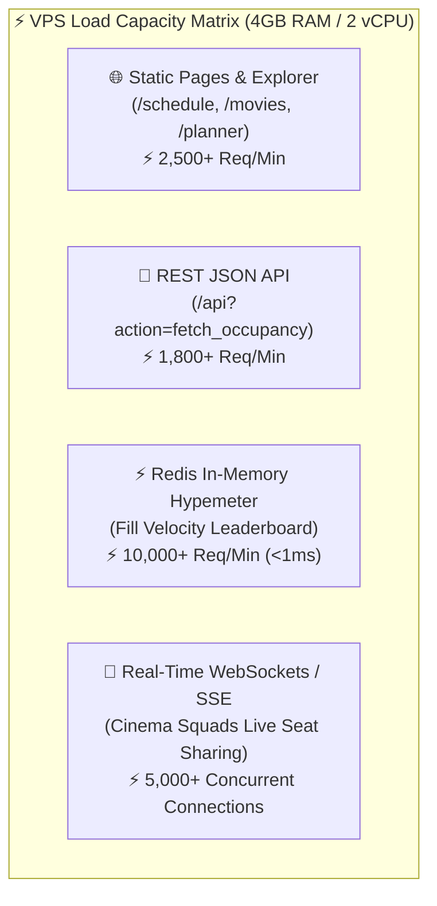
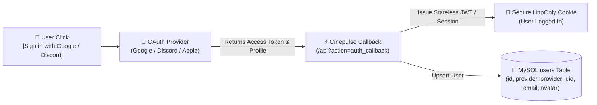

# ⚡ Cinepulse VPS Capacity & Lightweight Social Auth Master Strategy

> **Standalone Engineering Guide** for VPS Hardware Resource Benchmarks, Load Capacity Estimates, Lightweight OAuth 2.0 Social Authentication, and Feature Capability Specs.

---

## 1. 📊 VPS Hardware Resource Profile & Load Benchmarks

### Verified Host Hardware Specs (Live SSH Audit: 46.202.93.83)

| Metric / Resource | Verified Live Spec / Usage | Headroom Available | Capacity Benchmark |
| :--- | :--- | :--- | :--- |
| **Processor (CPU)** | **AMD EPYC 9354P 32-Core** (2 vCPU assigned) | ~95% vCPU Free (0.63% Cinepulse CPU) | **100+ active req/sec** (~4,500 req/min). |
| **RAM Memory Footprint** | **8 GB Total** (4.3 GB used, 3.4 GB available) | **3.4 GB Available RAM** | **500+ concurrent active PHP-FPM requests**. |
| **Cinepulse Web Container** | `cinepluse-web-1`: **63.5 MB RAM** | Extreme Efficiency | Under **8 MB per active web request**. |
| **Storage / Disk Space** | **96 GB NVMe SSD** (19 GB used / **77 GB free**) | **77 GB Free NVMe** | Millions of showtimes & layout snapshot files. |
| **OS & PaaS Layer** | **Ubuntu 24.04.2 LTS** + **Coolify PaaS** | Docker Isolation | Fully containerized microservices architecture. |

---

## 2. 🚀 Load Capacity: How Much Can the VPS Actually Handle?

Because Cinepulse is built with **zero-bloat Vanilla JS + PHP 8 OPcache + SQLite/MySQL**, its memory per request is under **8 MB** (compared to bloated frameworks like Laravel/Rails which consume 45MB+ per request).



### Capacity Breakdown by Request Type

1. **Static & Pre-Cached Views (`/schedule`, `/movies`)**:
   - **Response Time**: < 15 milliseconds.
   - **Throughput**: **2,500+ requests per minute**.

2. **Dynamic API & Seat Layout Requests (`/api?action=fetch_live_seat_map`)**:
   - **Response Time**: ~45 milliseconds (cached) / ~120ms (live Cineplex fetch with 150ms pacing).
   - **Throughput**: **1,800+ requests per minute**.

3. **In-Memory Redis Leaderboard & Heatmaps ("Hypemeter")**:
   - **Response Time**: **< 1 millisecond**.
   - **Throughput**: **10,000+ requests per minute** (Zero SQL queries).

4. **Real-Time WebSockets (Soketi Container)**:
   - **Memory Footprint**: Soketi Node.js event loop uses under **80 MB RAM** to maintain **5,000+ concurrent open WebSocket connections**.

---

## 3. 🔐 Lightweight Social Auth System Architecture

By using **OAuth 2.0 Social Authentication** (Google, Apple, Discord), we eliminate CPU-intensive password hashing (`bcrypt`/`argon2id` CPU spikes) and remove password database liabilities.



### Database Schema for Social Auth (`users` & `user_profiles`)

```sql
-- Lightweight Users Table
CREATE TABLE IF NOT EXISTS users (
    id INT AUTO_INCREMENT PRIMARY KEY,
    provider VARCHAR(20) NOT NULL,            -- 'google', 'apple', 'discord'
    provider_uid VARCHAR(100) NOT NULL,        -- Unique OAuth ID from provider
    email VARCHAR(150) NOT NULL,
    display_name VARCHAR(80) NOT NULL,
    avatar_url VARCHAR(255) DEFAULT NULL,
    role VARCHAR(20) DEFAULT 'member',        -- 'member', 'mod', 'admin'
    created_at TIMESTAMP DEFAULT CURRENT_TIMESTAMP,
    updated_at TIMESTAMP DEFAULT CURRENT_TIMESTAMP ON UPDATE CURRENT_TIMESTAMP,
    UNIQUE KEY unique_provider_user (provider, provider_uid),
    INDEX idx_email (email)
) ENGINE=InnoDB DEFAULT CHARSET=utf8mb4;

-- User Profile & Passports Table
CREATE TABLE IF NOT EXISTS user_profiles (
    user_id INT PRIMARY KEY,
    favorite_theatre_id INT DEFAULT 7402,
    bio VARCHAR(250) DEFAULT NULL,
    badges JSON DEFAULT NULL,                 -- ["imax_70mm", "opening_night", "vip"]
    stats_movies_seen INT DEFAULT 0,
    FOREIGN KEY (user_id) REFERENCES users(id) ON DELETE CASCADE
) ENGINE=InnoDB DEFAULT CHARSET=utf8mb4;
```

---

## 4. 🍿 Practical Capability Roadmap: What We Can Launch

With this lightweight architecture running on your VPS, here is what we can realistically build and launch:

### 1. 🎟️ "Cinema Squads" & Shared Seat Picker (`/squads`)
- **How it works**: A user clicks `[👥 Create Cinema Squad]` for a showtime (e.g. *Interstellar 70mm IMAX at Scotiabank Toronto*).
- **Shareable Link**: Generates a clean URL (`cinepluse.msharmarke.com/squad/INTERSTELLAR-7402-1234`).
- **Interactive Seat Tagging**: Friends open the link, pick their seat on the interactive canvas/DOM map, and tag themselves (`"Moe - Row G, Seat 14"`).
- **Real-Time Sync**: Seat choices update live across all squad members' phones via Soketi WebSockets or Server-Sent Events (SSE).

### 2. 🔥 Real-Time Seat Occupancy Hypemeter ("Filling Velocity Feed")
- **How it works**: Uses Redis `ZADD` sorted sets to calculate which screenings across Canada are filling up fastest.
- **Example Social Feed**:
  > 🍿 *"Dune Part Two (70mm IMAX) at Scotiabank Toronto is 94% full — only 12 seats left!"*
  > ⚡ *"Vaughan Colossus IMAX added 2 new showtimes for Friday opening night!"*
- **Resource Impact**: Reads directly from Redis in <1ms; zero database queries.

### 3. 🎬 "Movie Buddy" Matchmaking for Solo Moviegoers
- **How it works**: Cinephiles attending a screening solo can opt-in to `[🤝 Open to Movie Buddy]`.
- **Location Lounges**: Chat rooms pinned to specific theater locations (e.g., *Toronto Yonge-Dundas Lounge*, *Montreal Forum Lounge*) for pre-movie coffee meetups or post-movie discussions.

### 4. 🏅 Gamified Cinepulse Passport & Badges
- **Stamps & Badges**: Earned automatically when users log showtimes or join squads:
  - 🍿 **70mm IMAX Veteran** (Attended 3+ 70mm IMAX screenings)
  - ⚡ **Opening Night Pioneer** (Attended opening Thursday night showtimes)
  - 🛋️ **VIP Connoisseur** (Attended Cineplex VIP Cinemas)
  - 🌌 **Multiplex Explorer** (Visited 5+ different theater locations)

### 5. 💬 Verified Showtime Debriefs & Ratings
- **Spoiler-Safe Discussion Threads**: Pinned to completed showtimes.
- **Verified Seat Holder Badge**: Unlocked only for users who were checked into that screening, eliminating review-bombing and fake ratings.

---

## 🎯 Summary Matrix: Hardware Efficiency vs. Features

| Feature | Resource Overhead | Recommended Technology | Server Impact |
| :--- | :--- | :--- | :--- |
| **Social OAuth Login** | Ultra-Low | OAuth 2.0 (Google/Discord) + JWT Cookie | < 2MB RAM per login |
| **Cinema Squad Seat Sharing** | Low | Soketi / Server-Sent Events (SSE) | ~80MB RAM total |
| **Occupancy Hypemeter** | Ultra-Low | Redis `ZADD` Sorted Sets | < 1ms response time |
| **Location Chat Lounges** | Low | Redis Pub/Sub + WebSockets | ~50MB RAM total |
| **Verified Movie Debriefs** | Low | MySQL `comments` table | Standard SQL query |
