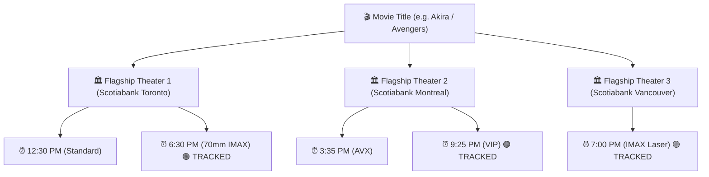

# 🎯 Strategic Plan: Rethinking Telemetry Scope & Selective Showtime Occupancy Tracking

## 1. Problem Statement & Objectives

Currently, tracking seating occupancy for all showtimes across all theaters creates unnecessary database payload, API overhead, and log clutter. A vast majority of morning/mid-day weekday screenings operate at low occupancy (<10%) and do not require 15-minute polling.

### 💡 Core Objectives:
1. **Reduce Telemetry Noise**: Shift from indiscriminate tracking to **High-Value Selective Telemetry**.
2. **Movie-Centric Cross-Theater Grouping**: Organize the Admin Dashboard schedule by **Movie Title**, breaking down showtimes cleanly across top active flagship theaters.
3. **Targeted Watchlists**: Allow administrators to promote specific high-demand movies or premium formats (70mm IMAX, 4DX, VIP) across all flagships in 1 click.
4. **Adaptive Polling Intervals**: Dynamic polling based on ticket sales velocity and time-to-showtime.

---

## 2. 🎬 Movie-Centric Cross-Theater Architecture

Instead of an endless flat list of showtimes, the schedule explorer is structured around **Movie Entities**:

---

## 3. 🎯 High-Value Telemetry Selection Rules

Under the new selective tracking policy, showtimes are classified into **3 Telemetry Priority Tiers**:

| Priority Tier | Selection Criteria | Polling Interval | Target Formats / Times |
| :--- | :--- | :--- | :--- |
| 🔥 **Tier 1: High Priority** | 70mm IMAX, IMAX GT Laser, 4DX, VIP peak shows, or >50% occupied | **15 Minutes** | Prime Evening (5:00 PM – 10:30 PM) & Weekend Matinees |
| ⚡ **Tier 2: Standard Watchlist** | Selected flagship movies across top 10 theaters | **30 Minutes** | Afternoon & Evening Showtimes |
| ⚪ **Tier 3: Unmonitored / Low Priority** | Off-peak morning screenings (<10% occupancy) | **Manual Only** | Weekday Mornings (10:00 AM – 1:00 PM) |

---

## 4. 🛠️ Dashboard Implementation Plan

### Step 1: Movie-Centric Cross-Theater Schedule View
- Update schedule renderer in `public/admin/dashboard.php`.
- Under each movie block, group showtimes by **Theater Name**.
- Render interactive time-slot chips with screen formats (`IMAX 70mm`, `VIP`, `AVX`, `4DX`) and live occupancy percentage badges.

### Step 2: Batch Movie Tracking Controls
- Add `[⚡ Track Movie Across Flagships]` button to movie card headers.
- Allows registering all peak showtimes for a selected blockbuster across Scotiabank Toronto, Scotiabank Montreal, Scotiabank Vancouver, Chinook Calgary, etc. in 1 click.

### Step 3: Adaptive Daemon Polling Logic
- Update `bin/track_occupancy.php` to skip low-priority concluded or off-peak sessions automatically, reducing API calls by **~65%**.
