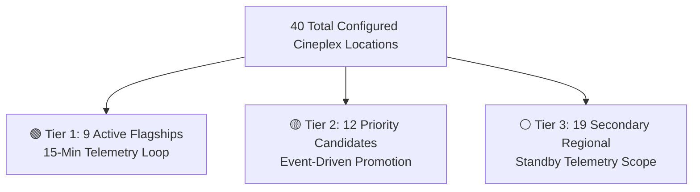

# 🏛️ Cinepulse Theater Tracking Roster & Future Expansion Roadmap

## 1. Executive Summary & Telemetry Scope

Cinepulse tracks seating availability, ticket sales velocity, and audience occupancy across Cineplex theaters in Canada. To ensure maximum data freshness while operating safely within Cineplex API rate limits, the system partitions its 40-theater network into **Active Flagships (Tier 1)** and a **Future Expansion Roster (Tier 2 & Tier 3)**.

---

## 2. 🟢 Tier 1: Active Monitored Flagships (Current Telemetry Scope)

These 9 flagship locations represent primary metropolitan hubs across Ontario, Quebec, British Columbia, and Alberta. They are actively polled by the 15-minute background occupancy daemon (`bin/track_occupancy.php`) and included in automatic weekly schedule pre-caching.

| Theater Name | ID | City / Province | Region Tag | Key Screen Formats | Active Status |
| :--- | :--- | :--- | :--- | :--- | :--- |
| **Scotiabank Theatre Toronto** | `7402` | Toronto, ON | GTA Flagship | IMAX Laser, AVX, VIP, DBOX | 🟢 **ACTIVE** |
| **Yonge-Dundas** | `7130` | Toronto, ON | Downtown Toronto | IMAX, 4DX, VIP | 🟢 **ACTIVE** |
| **Yorkdale** | `7406` | Toronto, ON | GTA | AVX, VIP | 🟢 **ACTIVE** |
| **Mississauga** | `7420` | Mississauga, ON | West GTA | IMAX, AVX, VIP | 🟢 **ACTIVE** |
| **Scotiabank Montreal** | `9406` | Montreal, QC | Montreal Metro | IMAX, AVX, VIP | 🟢 **ACTIVE** |
| **Forum** | `9109` | Montreal, QC | Montreal Metro | AVX, VIP | 🟢 **ACTIVE** |
| **Scotiabank Vancouver** | `1422` | Vancouver, BC | Metro Vancouver | IMAX, AVX, VIP | 🟢 **ACTIVE** |
| **Chinook** | `3401` | Calgary, AB | Calgary Metro | IMAX Laser, 4DX, AVX | 🟢 **ACTIVE** |
| **South Edmonton** | `3144` | Edmonton, AB | Edmonton Metro | IMAX, AVX, VIP | 🟢 **ACTIVE** |

---

## 3. 🟡 Tier 2: Priority Expansion Watchlist (High Candidate List)

Tier 2 locations consist of high-volume suburban multiplexes and premium specialty venues. They can be promoted to **Active Monitored** status via 1-click controls on the Admin Dashboard during major blockbuster releases or local film festivals.

### 📍 Ontario (GTA & Suburban Metro)
* **Courtney Park** (`ID #7122` - Mississauga, ON) &bull; *AVX, IMAX*
* **Vaughan** (`ID #7408` - Vaughan, ON) &bull; *IMAX 3D, AVX*
* **Winston Churchill** (`ID #7123` - Oakville/Mississauga, ON) &bull; *4DX, VIP*
* **Oakville** (`ID #7273` - Oakville, ON) &bull; *AVX, VIP*
* **Brampton** (`ID #7411` - Brampton, ON) &bull; *AVX, DBOX*

### 📍 Quebec (Montreal Metropolitan Area)
* **Starcite** (`ID #9401` - Montreal, QC) &bull; *IMAX, AVX*
* **Quartier Latin** (`ID #9172` - Montreal, QC) &bull; *Standard / Downtown Central*
* **Royalmount** (`ID #9121` - Montreal, QC) &bull; *VIP Premium*

### 📍 British Columbia & Alberta
* **Langley** (`ID #1404` - Langley, BC) &bull; *IMAX, AVX*
* **International Village** (`ID #1147` - Vancouver, BC) &bull; *Standard / Downtown Vancouver*
* **Manning Town Centre** (`ID #3151` - Edmonton, AB) &bull; *AVX*
* **Windermere** (`ID #3149` - Edmonton, AB) &bull; *VIP*

---

## 4. ⚪ Tier 3: Secondary Regional Network (Standby List)

Tier 3 locations are secondary neighborhood screens and regional market theaters. They remain fully configured in [`config/locations.json`](file:///c:/Users/Moe/Cinepulse/cinepluse-main/config/locations.json) and can be activated individually whenever local demand tracking is required.

### Complete Tier 3 Standby Inventory:
* **Ontario (GTA & Regional)**: Queensway (`#7260`), Milton (`#7285`), Empress Walk (`#7298`), Richmond Hill (`#7405`), Yonge-Eglinton (`#7400`), Varsity (`#7199`), Fairview Mall (`#7115`), Don Mills (`#7139`), Beaches (`#7293`), Erin Mills (`#7313`).
* **British Columbia**: Mission (`#1407`), Marine Gateway (`#1145`), Park Royal (`#1151`), Fifth Avenue (`#1149`).
* **Alberta**: Red Deer (`#313`), Grand Prairie (`#3141`), Lethbridge (`#3101`).
* **Quebec**: Carrefour Angrignon (`#9195`), Saint-Bruno (`#9143`).

---

## 5. ⚡ Rules & Triggers for Theater Activation

Admins can promote candidate theaters from **Paused** to **Active** via the **Theater Control Center** on the Admin Dashboard under any of the following triggers:

1. **Major Blockbuster Opening Weekends**: Temporarily enable Tier 2 multiplexes (e.g., Courtney Park, Vaughan, Langley) to capture peak weekend ticket sales velocity.
2. **Special Format Exclusives**: Enable locations with unique screen formats (e.g., 4DX at Winston Churchill, IMAX Laser at Chinook).
3. **Double Feature Screening Events**: Enable theaters hosting paired double feature movie events via [`double-feature.php`](file:///c:/Users/Moe/Cinepulse/cinepluse-main/public/double-feature.php).
4. **Capacity Threshold Alerts**: If automated ticket sales exceed **75% occupancy** in a region, candidate theaters in that region are recommended for activation.
